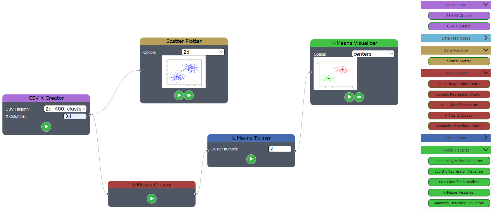

# 
 **Ceres** - Online Machine Learning Platform 

Ceres is an online platform to help you implement your Machine Learning model with graph based node editor. It is aimed at ease-of-use and perfectly suitable for newcomers to learning methods!

## Features:
- Graph Based Node Editor
- Social Hub for Repositories
- Cloud Solution for Datasets
---

 

 

This is a senior year project done at METU Computer Engineering, 2021.

Supervised by dear Assoc. Prof. Sinan Kalkan and implemented by Y. Cahit Yıldırım, Akif Üslü, Ömer Ege Kara, Bahadır Coşkun.

**Disclaimer: The project is not finished by any means. Also, it is stagnate, no advancement is expected.** 